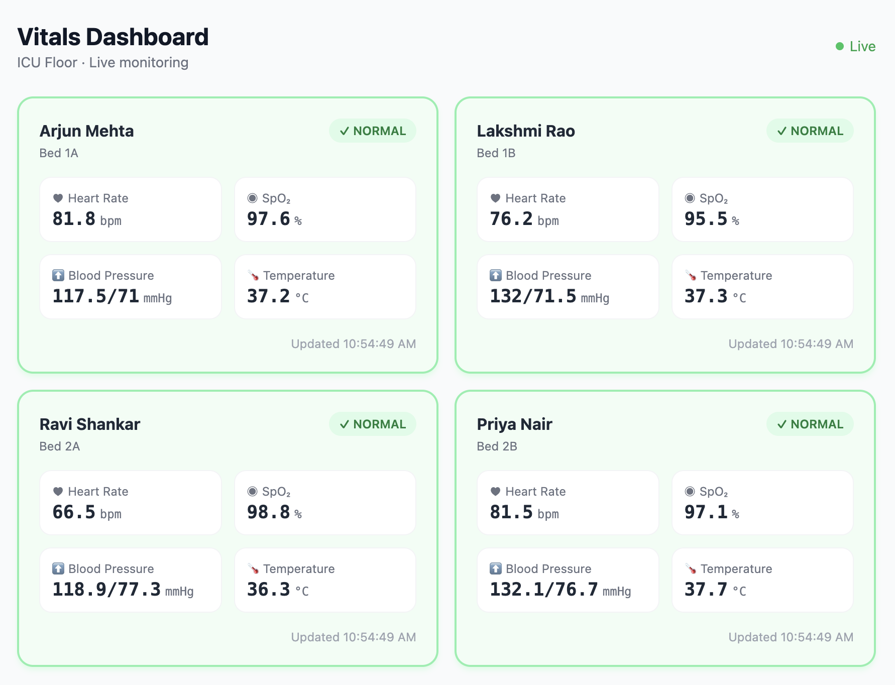

# cloudspend

An ETL pipeline and cost analytics dashboard for cloud infrastructure spend. Parses billing exports, normalizes them into a local SQLite database, and renders an interactive Plotly Dash dashboard.

Built to practice data engineering fundamentals — extraction, transformation, schema design, and visualization — without needing a live cloud account.

## What it does

- Ingests billing CSV exports (simulated AWS/GCP-style format included)
- Normalizes raw records into a structured cost schema
- Runs daily aggregations by service, region, and tag
- Identifies top cost drivers and anomalies (spend spikes > 2 standard deviations)
- Renders a Dash dashboard with: monthly trend, service breakdown, region heatmap, anomaly table
  
## Dashboard



## Tech stack

| | |
|---|---|
| Language | Python 3.11 |
| ETL | pandas, custom extractor/transformer/loader classes |
| Database | SQLite (local dev) |
| Dashboard | Plotly Dash |
| Tests | pytest |
| CI | GitHub Actions |

## Getting started

### Prerequisites

- Python 3.11+

### Install

```bash
git clone https://github.com/udaydande/cloudspend.git
cd cloudspend
python -m venv .venv
source .venv/bin/activate       # Windows: .venv\Scripts\activate
pip install -r requirements.txt
```

### Run the ETL pipeline

```bash
# Seeds the DB with 6 months of simulated billing data
python -m cloudspend.pipeline --seed

# Or load your own CSV export
python -m cloudspend.pipeline --input path/to/billing_export.csv
```

### Launch the dashboard

```bash
python -m cloudspend.dashboard.app
```

Open http://localhost:8050

## Project structure

```
cloudspend/
├── cloudspend/
│   ├── extractors/     Read CSVs, normalize column names
│   ├── transformers/   Aggregations, anomaly detection
│   ├── loaders/        Write to SQLite
│   └── dashboard/      Plotly Dash app
├── sql/
│   └── migrations/     Schema DDL
├── tests/              pytest unit + integration tests
├── data/               Sample billing CSVs (gitignored for large files)
└── pipeline.py         CLI entrypoint
```

## Input CSV format

```
date,service,region,resource_id,usage_type,usage_amount,cost,currency,tag_env,tag_team
2024-01-01,Compute,us-east-1,i-0abc123,BoxUsage:t3.medium,744,82.56,USD,prod,platform
```

## Running tests

```bash
pytest tests/ -v
```

## CI

Runs lint (flake8) and pytest on every push. See `.github/workflows/ci.yml`.

## License

MIT
